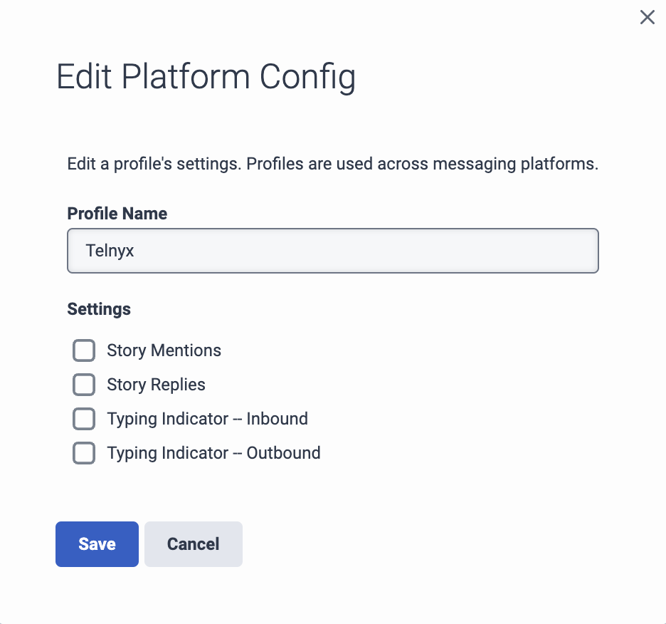
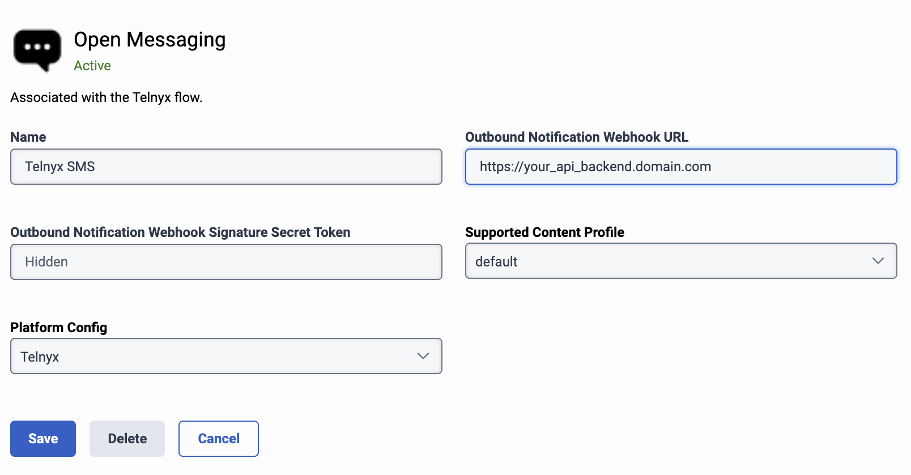
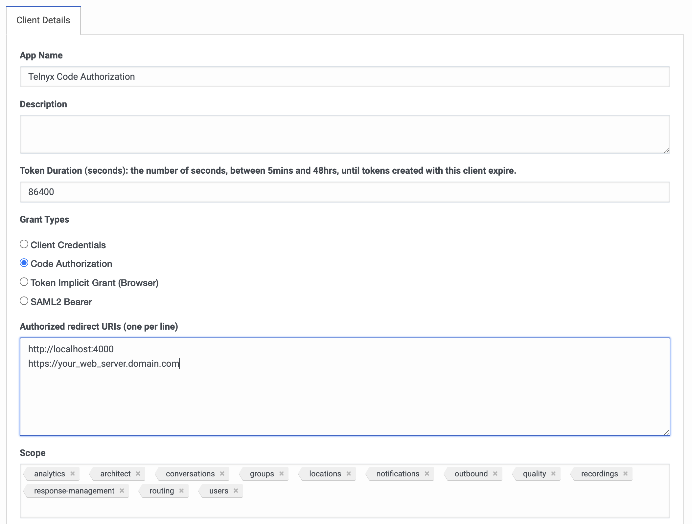
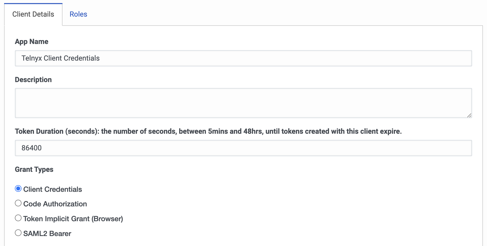
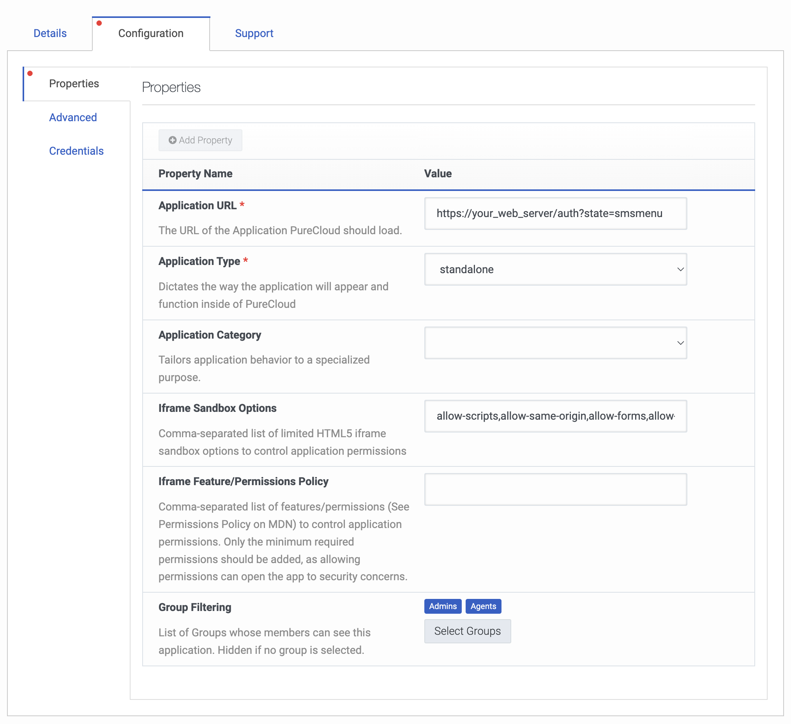
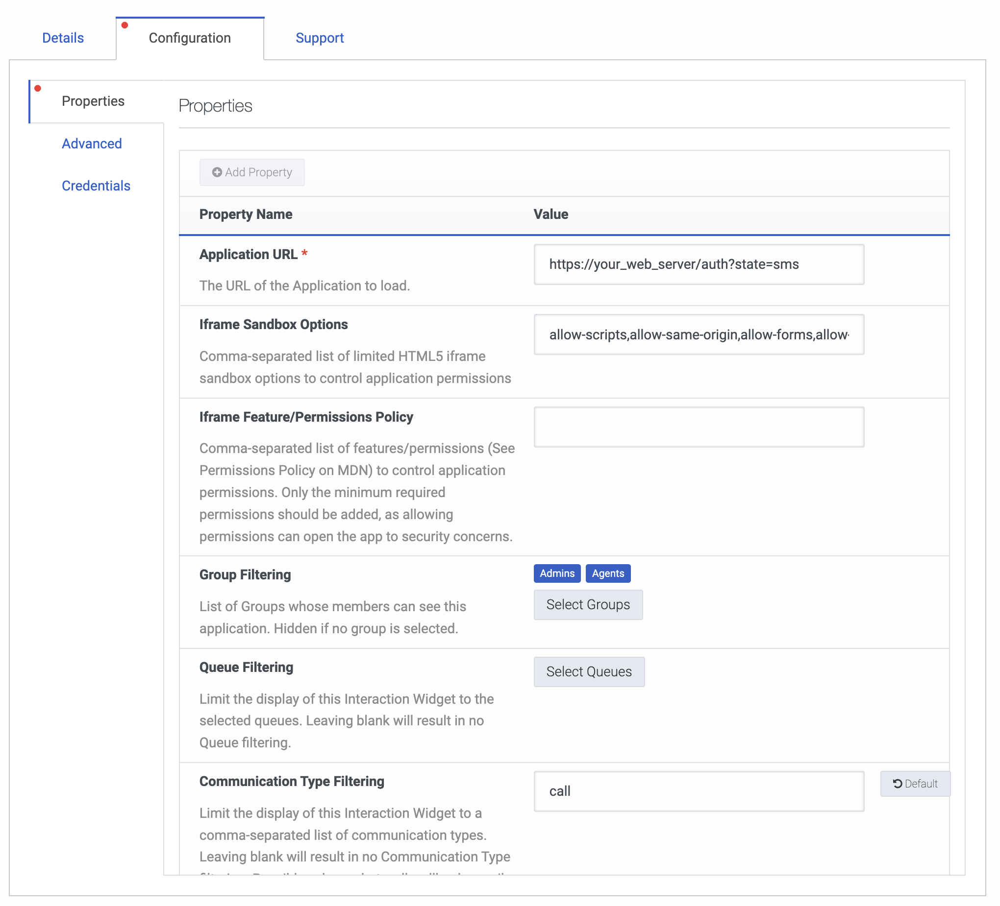
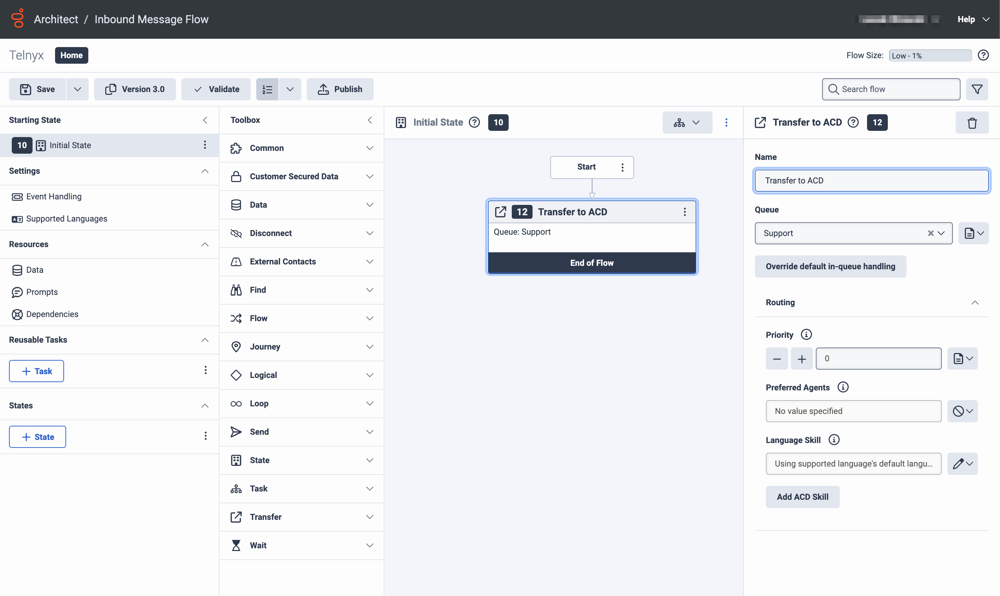
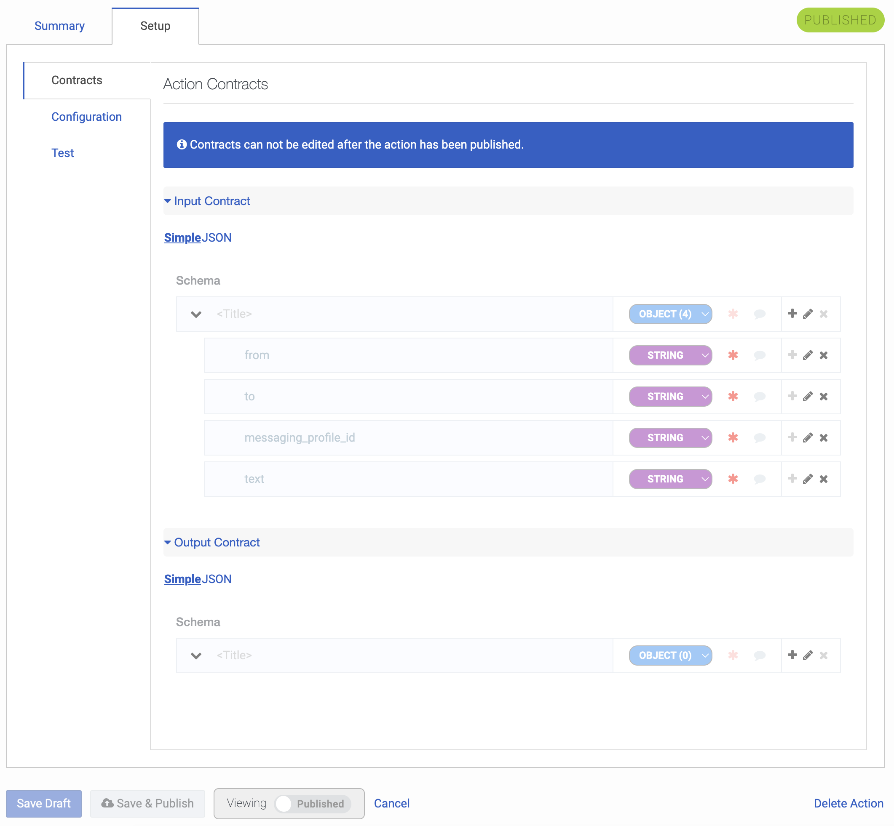
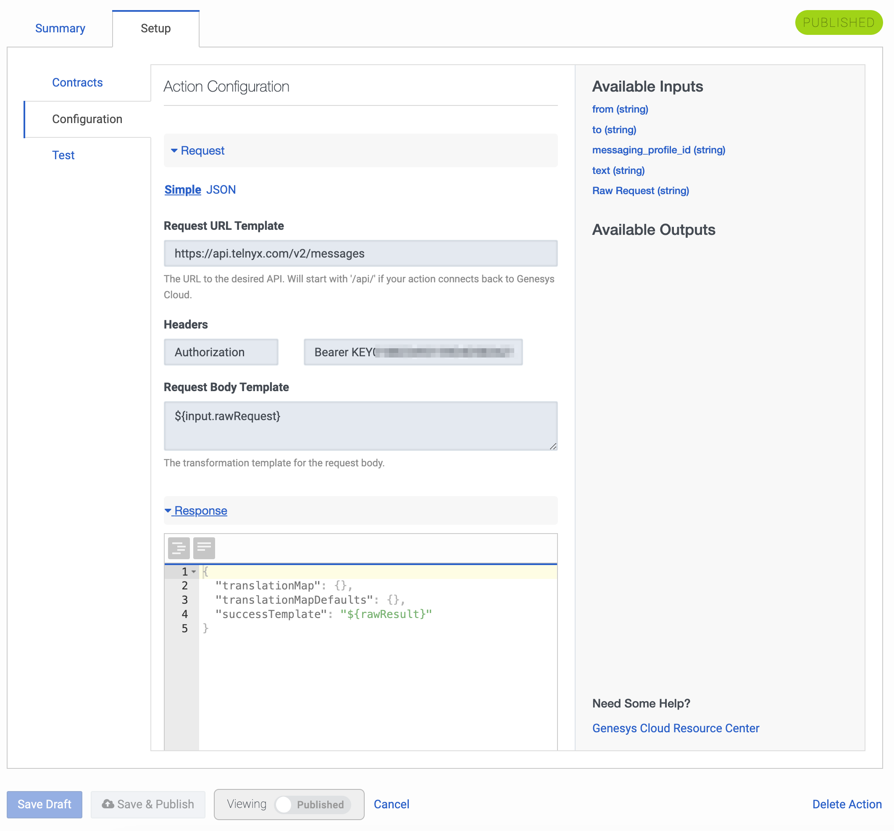

# Telnyx SMS API with Genesys Cloud Open Messaging Integration

This is a sample app preseting integration between Telnyx SMS API and Genesys Cloud Open messaging interface. It support the following features:

1. 2-way messaging communication in a native Genesys Cloud chat interface
2. Custom app available as a widget to send SMS during voice call
3. Custom app to handle outbound campaigns based on GC contact lists and message templates
4. Use Web Services Data Action to trigger outbound SMS in Architect or send SMS from a scripting tool
5. Custom app with the iintegration to the Telnyx Number Lookup API to check information about the number.
6. Run Number Lookup campaign to verify the numbers in the contact list

---

## Getting Started

In this guide, you’ll learn how configure everything to run the sample apps.

Just follow these steps:

1. Sign up for a Telnyx Account
2. Create an API KEY and purchase a number
3. Configure Messaging Profile
4. Configure Genesys Cloud
5. Set up environment variables
6. Run the code
7. Implement the app as a docker container

---

## Step 1: Sign Up for a Telnyx Mission Control Portal Account

Head to [telnyx.com/sign-up](https://telnyx.com/sign-up) to sign up for your free Telnyx account.

Once signed up you will have access to Telnyx Portal, where you can set up and manage your API KEY, purchase number(s) enabled for messaging.

## Step 2: Create an API KEY

Go to [API Keys](https://portal.telnyx.com/#/app/api-keys) section and click on `Create API Key` button. It will generate a key for you. Copy and save this key in a safe place and don't share it with anyone it is a sensitive value.

## Step 3: Configure Messaging Profile

Go to [Programmable Messaging](https://portal.telnyx.com/#/app/programmable-messaging/profiles) section and create a new messaging profile.
In the webhook URL field point to your backend server API endpoint.

## Step 4. Configure Genesys Cloud

For all details please refer to the Genesys Cloud Open Messaging integration here - https://help.mypurecloud.com/articles/get-started-with-open-messaging

1. Logon to GC organization with admin permissions.
   In the Message / Platform Configs menu create a new platform config

   

2. In the Message / Platforms menu create a new integration for Open Messaging and select platform config created in the previous step. Note the secret token provided there as you will need to set it in the server `.env` file.

   

3. In the Integrations / OAuth menu create a new Code Authorization grant type client and set the required scope - `architect`, `conversations`, `groups`, `notifications`, `outbound`, `response-management`, `routing` and `users`. Note the created `Client ID` and `Client Secret` fields and set it in the server `.env` file.

   

4. In the Integrations / OAuth menu create a new Client Credentials grant type client. Note the created `Client ID` and `Client Secret` and set it in the server `.env` file.

   

5. In the Integrations add a new Client Application for Telnyx SMS web application. In the Configuration tab provide Application URL pointing to your web server with a path `/auth?state=smsmenu` (e.g `https://yourweb.server.domain.com/auth?state=smsmenu`). To display just SMS tab use `/auth?states=sms`, for SMS Campaign tab use `/auth?state=smscampaign`

   

6. Repeat point 5 for Number Lookup application but use a different path `/auth?state=nlmenu`. To display just Number Lookup tab use `/auth?states=nl`, for NL Campaign tab use `/auth?state=nlcampaign`

7. In the Integrations menu create a new widget application to be available when handling voice calls. In the Configuration tab provide URL to your web server with the path `/auth?state=sms` (e.g. `https://your_web_server/auth?state=sms`)

   

In the Advanced tab provide the following JSON object:

```js
{
  "lifecycle": {
    "ephemeral": false,
    "hooks": {
      "focus": false,
      "blur": false,
      "bootstrap": false,
      "stop": false
    }
  },
  "icon": {
    "vector": "https://your_web_server/images/telnyx-color.svg"
  },
  "monochromicIcon": {
    "vector": "https://your_web_server/images/telnyx-color.svg"
  }
}
```

8. In Genesys Cloud Architect create a new Inbound Message Flow to route incoming SMSs to your queue



9. If you would like to send SMS from Genesys Cloud Architect or Scripter tool you can configure Web Services Data Action for Telnyx SMS API Send Message method as documented here - https://developers.telnyx.com/api/messaging/send-message

In the Contracts section create a JSON object with 4 required parameteres - `from`, `to`, `messaging_profile_id` and `text`



In the Configuration tab provide URL to Telnyx Send SMS POST method `https://api.telnyx.com/v2/messages` and configure `Authorization` header with your API key `Bearer KEY....`



## Step 5. Set up environment variables

Create a new copy of `.env.sample` with the name `.env` and set the variables listed in the files both in server and client folders:

Your `.env` files should look like this:

#### SERVER FOLDER

```js
# Environment
PORT=3000
NODE_ENV=prod
DEBUG=app:WWW,app:Telnyx,app:Genesys
DEBUG_DEPTH=8
WHITELISTED_DOMAINS= # Add your domains here separated by commas
API_SERVER_URL= # Add your API server URL here
WWW_SERVER_URL= # Add your WWW server URL here

# Telnyx
TELNYX_BASE_PATH=https://api.telnyx.com
TELNYX_API_KEY= # Add your Telnyx API key here
TELNYX_MESSAGING_PROFILE_ID= # Add your Telnyx messaging profile ID here
TELNYX_FROM_NUMBER= # Add your default Telnyx from number here

# Genesys
GC_CLIENT_ID= # Add your Client ID for Code Authorization grant type here
GC_CLIENT_SECRET= # Add your Client Secret for Code Authorization grant type here
GC_CLIENT_CRED_CLIENT_ID= # Add your Client ID for client credential grant type here
GC_CLIENT_CRED_CLIENT_SECRET= # Add your Client Secret for client credentials grant type here
GC_ENVIRONMENT= # Add your Genesys environment here e.g. usw2.pure.cloud
GC_MESSAGE_DEPLOYMENT_ID= # Add your Genesys message deployment ID here
GC_SECRET_TOKEN= # Add your Genesys secret token here
```

#### CLIENT FOLDER

```js
BUILD_PATH=./build
PORT=4000
REACT_APP_ENV=PRODUCTION
REACT_APP_API_URL= # Add your API server URL here
REACT_APP_GC_CLIENT_ID= # Add your Genesys client ID here
REACT_APP_GC_ENVIRONMENT= # Add your Genesys environment here e.g. usw2.pure.cloud
REACT_APP_SMS_FROM_DEFAULT_ID= # Add your default SMS from number here
REACT_APP_SMS_FROM_TABLE= # Add your SMS from table here e.g. TELNYX_SMS_FROM
REACT_APP_SMS_RESPONSES_PREFIX= # Add your SMS responses prefix here e.g. SMS_RESPONSES_
REACT_APP_SMS_TEMPLATES_PREFIX= # Add your SMS templates prefix here e.g. SMS_TEMPLATES_
REACT_APP_SMS_CONTACT_LISTS_PREFIX= # Add your SMS contact lists prefix here e.g. SMS_
REACT_APP_NL_CONTACT_LISTS_PREFIX= # Add your NL contact lists prefix here e.g. NL_
```

## Step 6: Run the code

After you have cloned this repo:

```bash
  % git clone https://github.com/team-telnyx/genesys-open-messaging.git
```

Run the commands

1 - `yarn install` to install the dependencies in a server folder

2 - `yarn start` will initialize the backend server.

## Step 7: Implement the app as a docker container

If you would like to deploy the app to your Docker infrastructure you can run `docker compose up --build -d` from a main folder.
