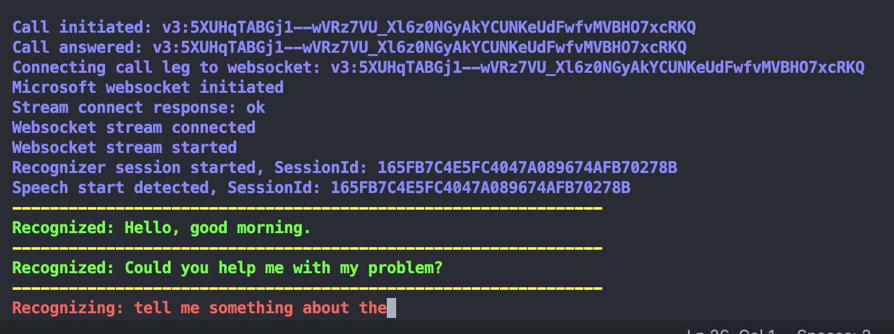
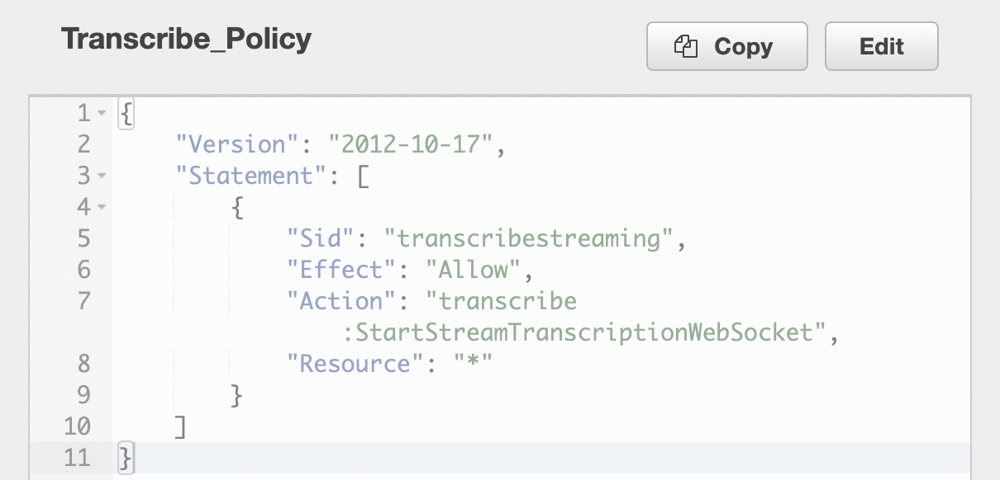
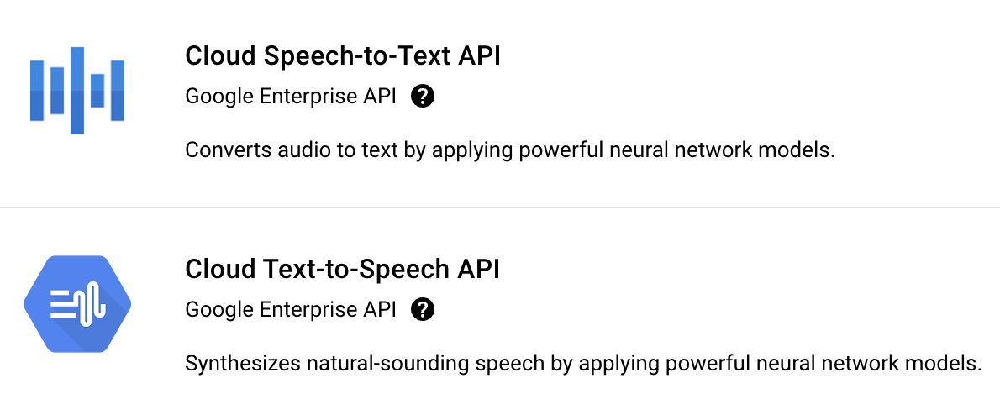
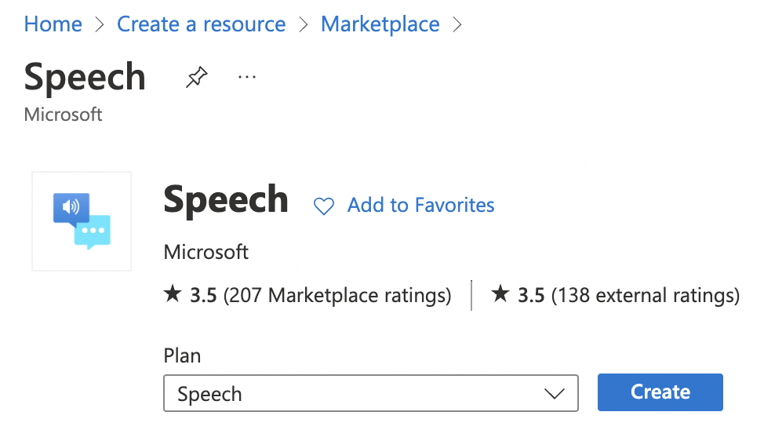

# Telnyx Voice API Call Transcription and Text to Speech with Amazon & Google & Microsoft

This code is an example to present how to use 2-way websocket interface available in Telnyx Voice API - [see details here](https://developers.telnyx.com/docs/api/v2/call-control/Call-Commands#callStreamingStart).
Application is transcribing a voice call online using a selected speech engine provider. You can choose between Amazon, Google and Microsoft based on your preferences or language coverage. Application is converting speech to text and playing back a transcribed text with a chosen TTS voice.



## Installation & Configuration

### Telnyx Account

If you haven't created yet an account in Telnyx Mission Control Portal please create a one usign this link - [sign up for a Telnyx account](https://telnyx.com/sign-up?referrer=https://telnyx.com/). You will get some credit to start with our platform.

### Purchase a number for the voice calls

To use this app you will need a phone number purchased on our platform. After logging to our Mission Control Portal go to the Number menu and purchase a number. You may need to verify your account first and provide the required documents to prove your address (depends on in-country regulations)

You can search for the available numbers [here](https://portal.telnyx.com/#/app/numbers/search-numbers)
Or use our API to search for the numbers available and purchase a one. Please refer to our documentation [here](https://developers.telnyx.com/docs/api/v2/numbers)

### Create a Voice API application

Create an application [here](https://portal.telnyx.com/#/app/call-control/applications) providing a webhook URL to your backend service. Telnyx platform will send all the notification about the call received with the status updates to this URL. It can be a URL pitning to your company domain or you can use a service like [NGROK](https://ngrok.com/) for testing purposes.

### Link the Voice API application to your purchased number

In the next step link your number to the applicaion configured under [Numbers](https://portal.telnyx.com/#/app/numbers/my-numbers) menu.

### Setup Amazon AWS / Google Cloud / Microsoft Azure account

Sign-in to the speech provider of your choice and provide the required credentials and additional parameters in the .env file.

#### For Amazon integration enable transcription service with the following policy:



#### For Google integration enable the following services:



#### For Microsoft integration enable the following resource:



### Set the environment variables

Copy `example.env` to `.env` and configure the following settings:

**# Web server parameters**

- `PORT`: port of the Express web server
- `WS_URL`: URL to a wesocket server (your domain or url provided from NGROK)

**# Bot parameters**

- `BOT_PROVIDER`: name of the speech engine provide, accepted values - "amazon" or "google" or "microsoft"
- `BOT_LANGUAGE`: language to be used for speech to text and text to speech (en-US, de-DE etc.)
- `WELCOME_PROMPT`: welcome prompt to be played back with TTS at the beginning of the call

**# Telnyx parameters**

- `TELNYX_API_KEY`: your Telnyx API key visible under your account
- `TELNYX_API_URL`: Telnyx API URL in your preffered region (api.telnyx.com, api.telnyx.eu etc.)

**# Microsoft parameters**

- `MS_SUBSCRIPTION_KEY`: your Microsoft Azure subscription key
- `MS_SERVICE_REGION`: your Microsoft Azure region
- `MS_TTS_VOICE`: TTS voice name of your choice, please refer to this [page](https://docs.microsoft.com/en-us/azure/cognitive-services/speech-service/language-support?tabs=stt-tts)

**# Google parameters**

- `GOOGLE_SAMPLE_RATE`: it should be set to `8000`
- `GOOGLE_ENCODING`: it should be set to `MULAW`
- `GOOGLE_VOICE_NAME`: TTS voice name of your choice, refer to this [page](https://cloud.google.com/text-to-speech/docs/voices)
- `GOOGLE_APPLICATION_CREDENTIALS`: path to the file with Google credentials (exported json file), it should be placed in a `/app/config` subfolder, sample name `./app/config/google.json`

**# Amazon parameters**

- `AWS_ACCESS_KEY_ID`: your Amazon AWS access key id with the permissions to speech to text and Polly TTS services
- `AWS_SECRET_ACCESS_KEY`: your Amazon AWS access key secret
- `AWS_REGION`: your Amazon AWS region
- `AWS_SAMPLE_RATE`: speech service sample rate, it should be set to `16000`
- `AWS_MEDIA_ENCODING`: speech encoding, it should be set to `pcm`
- `AWS_VOICE_NAME`: TTS voice name of your choice, refer to this [page](https://docs.aws.amazon.com/polly/latest/dg/voicelist.html)

## Running the code

### Local deployment

1. You need NodeJS environment to run this app

2. Clone the application from a GitHub repossitory

```
git clone https://github.com/leszek-telnyx/telnyx-websocket-demo.git
```

3. Go to a cloned app directory and install the modules

```
npm install
```

4. In the root directory of your application please execute:

```
node index.js
```

or if you prefer nodemon you can run

```
nodemon
```

5. Call your Telnyx number and observe the log messages in a console

6. You will hear a welcome prompt which is configured in .env file under `WELCOME_PROMPT` parameter

7. Now you can say anything, your voice will be converted to text and displayed in a console. Later the recognized text will be played back with TTS voice.

### Deploy the App to a Docker container with a Docker Compose

You can also deploy an app as a Docker container using the following command. In the app repository there is a `docker-compose.yml` file included which provides the config to setup a Docker container.

```
docker-compose up -d
```

## Other options

You can also test voice to text transcription using your computer microphone. Please check the file record.js which is using Google Cloud.
You need to install SOX library to use this app:

```
brew install sox
```

Run this app with a following command:

```
npm run record
```

or

```
nodemon record.js
```

## Further Reading

- Check our Developer documentation for call control [here](https://developers.telnyx.com/docs/v2/call-control?lang=node)
- Full API documentation is available [here](https://developers.telnyx.com/docs/api/v2/overview?lang=node)
