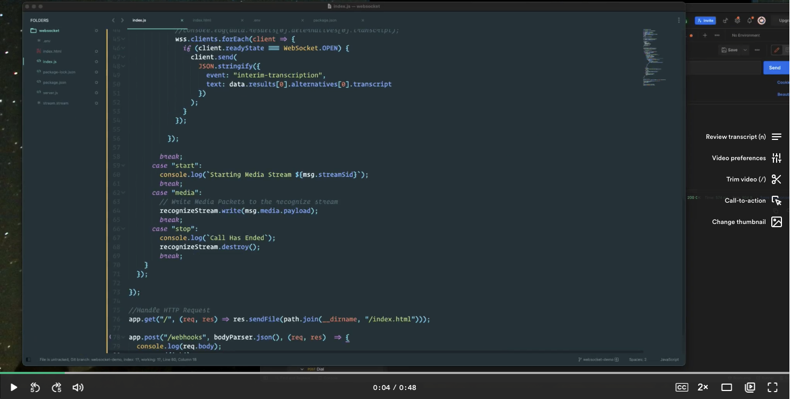

<div align="center">

# Telnyx-Node WebSocket Demo


Sample application demonstrating Telnyx-Node WebSocket Handling

</div>

## Documentation & Tutorial

The full documentation and tutorial is available on developers.telnyx.com

[](https://loom.com/share/433e7aa450a1475e854632117720fbd9)

## Pre-Reqs

You will need to set up:

* [Telnyx Account](https://telnyx.com/sign-up?utm_source=referral&utm_medium=github_referral&utm_campaign=cross-site-link)
* [Telnyx Phone Number](https://portal.telnyx.com/#/app/numbers/my-numbers?utm_source=referral&utm_medium=github_referral&utm_campaign=cross-site-link) enabled with:
  * [Telnyx Call Control Application](https://portal.telnyx.com/#/app/call-control/applications?utm_source=referral&utm_medium=github_referral&utm_campaign=cross-site-link)
  * [Telnyx Outbound Voice Profile](https://portal.telnyx.com/#/app/outbound-profiles?utm_source=referral&utm_medium=github_referral&utm_campaign=cross-site-link)
* Ability to receive webhooks (with something like [ngrok](https://developers.telnyx.com/docs/v2/development/ngrok?utm_source=referral&utm_medium=github_referral&utm_campaign=cross-site-link))
* [Node & NPM](https://developers.telnyx.com/docs/v2/development/dev-env-setup?lang=node&utm_source=referral&utm_medium=github_referral&utm_campaign=cross-site-link) installed
* Google Developers Account with AI app created

## What you can do

* Create an outbound call with CURL or Postman
* Answer the call and get a live transcription

## Usage

The following environmental variables need to be set

| Variable               | Description                                                                                                                                              |
|:-----------------------|:---------------------------------------------------------------------------------------------------------------------------------------------------------|
| `TELNYX_API_KEY`       | Your [Telnyx API Key](https://portal.telnyx.com/#/app/api-keys?utm_source=referral&utm_medium=github_referral&utm_campaign=cross-site-link)              |
| `TELNYX_PUBLIC_KEY`    | Your [Telnyx Public Key](https://portal.telnyx.com/#/app/account/public-key?utm_source=referral&utm_medium=github_referral&utm_campaign=cross-site-link) |
| `TELNYX_APP_PORT`      | **Defaults to `8000`** The port the app will be served                                                                                                   |
| `BASE_URL`             | Your **NGROK DOMAIN** like `"http://your-url.ngrok.io"`                                                                                                  |
| `TELNYX_CONNECTION_ID` | The ID of the [call-control-connection](https://portal.telnyx.com/#/app/call-control/applications) to use for placing the calls                          |

### .env file

This app uses the excellent [dotenv](https://github.com/motdotla/dotenv) package to manage environment variables.

Make a copy of [`.env.sample`](./.env.sample) and save as `.env` and update the variables to match your creds.

```
TELNYX_PUBLIC_KEY="KEYasdf"
TELNYX_API_KEY="+kWXUag92mcU="
TELNYX_APP_PORT=8000
TELNYX_CONNECTION_ID=1494404757140276705
BASE_URL="http://your-url.ngrok.io"
```

### Callback URLs For Telnyx Applications

| Callback Type                         | URL                                 |
|:--------------------------------------|:------------------------------------|
| Outbound Call-Control Status Callback | `{ngrok-url}/webhooks` |

### Install

Run the following commands to get started

```
$ git clone https://github.com/team-telnyx/demo-node-telnyx.git
$ cd websocket
```

### Ngrok

This application is served on the port defined in the runtime environment (or in the `.env` file). Be sure to launch [ngrok](https://developers.telnyx.com/docs/v2/development/ngrok?utm_source=referral&utm_medium=github_referral&utm_campaign=cross-site-link) for that port

```
./ngrok http 8000
```

> Terminal should look _something_ like

```
ngrok by @inconshreveable                                                                                                                               (Ctrl+C to quit)

Session Status                online
Account                       Little Bobby Tables (Plan: Free)
Version                       2.3.35
Region                        United States (us)
Web Interface                 http://127.0.0.1:4040
Forwarding                    http://your-url.ngrok.io -> http://localhost:8000
Forwarding                    https://your-url.ngrok.io -> http://localhost:8000

Connections                   ttl     opn     rt1     rt5     p50     p90
                              0       0       0.00    0.00    0.00    0.00
```

At this point you can point your application to generated ngrok URL + path  (Example: `http://{your-url}.ngrok.io/call-control/inbound`).

### Run

Start the server `node index.js`

When you are able to run the server locally, the final step involves making your application accessible from the internet. So far, we've set up a local web server. This is typically not accessible from the public internet, making testing inbound requests to web applications difficult.

The best workaround is a tunneling service. They come with client software that runs on your computer and opens an outgoing permanent connection to a publicly available server in a data center. Then, they assign a public URL (typically on a random or custom subdomain) on that server to your account. The public server acts as a proxy that accepts incoming connections to your URL, forwards (tunnels) them through the already established connection and sends them to the local web server as if they originated from the same machine. The most popular tunneling tool is `ngrok`. Check out the [ngrok setup](/docs/v2/development/ngrok) walkthrough to set it up on your computer and start receiving webhooks from inbound messages to your newly created application.

Once you've set up `ngrok` or another tunneling service you can add the public proxy URL to your Inbound Settings  in the Mission Control Portal. To do this, click  the edit symbol [✎] next to your Call-Control Profile. In the "Inbound Settings" > "Webhook URL" field, paste the forwarding address from ngrok into the Webhook URL field. Add `call-control/inbound` to the end of the URL to direct the request to the webhook endpoint in your  server.

For now you'll leave “Failover URL” blank, but if you'd like to have Telnyx resend the webhook in the case where sending to the Webhook URL fails, you can specify an alternate address in this field.

#### Create the call

Create the call with CURL or postman and point the `stream_url` to your ngrok url

```bash
curl --location --request POST 'https://api.telnyx.com/v2/calls' \
--header 'Content-Type: application/json' \
--header 'Authorization: Bearer {YOUR_API_KEY}' \
--data-raw '{
    "to": "{YOUR_PERSONAL_NUMBER}",
    "from": "{YOUR_TELNYX_PHONE_NUMBER}",
    "connection_id": "{YOUR_CONNECTION_ID}",
    "stream_url": "wss://{your_ngrok_url}",
    "stream_track": "both_tracks"
   
}'
```

